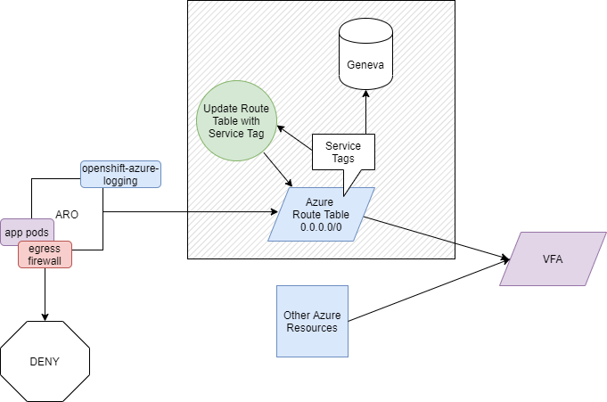

# Route Table Creator

:warning: Please note this is a sample application provided as-is.

This **sample** application will pull a list of IP addresses from the Azure Monitor, Azure Storage, Azure Resource Manager, Azure Event Hubs Service Tags and update or create an Azure Route Table which directs the next hop for these addresses to the Internet, all other traffic (0.0.0.0/0) is directed using a default route to the IP specified by ```--firewall```. It will assign this route table to each of the ```--subnets``` passed.

## Geneva

Geneva is a backend system used to manage and monitor clusters.  The purpose of this **sample** application is to create a route table that directs all Geneva bound traffic to the Azure backbone and forces all other traffic through a virtual firewall appliance such as an Azure Firewall.



## Azure Authentication

This code uses the latest Azure.Identity [DefaultAzureCredential](https://docs.microsoft.com/en-us/dotnet/api/azure.identity.defaultazurecredential?view=azure-dotnet) module for authentication.  

To use this with environment variables, set the following:

```bash

export AZURE_CLIENT_ID='xxxxxxxx-xxxx-xxxx-xxxx-xxxxxxxxxxxx'
export AZURE_CLIENT_SECRET='xxxx'
export AZURE_TENANT_ID='xxxxxxxx-xxxx-xxxx-xxxx-xxxxxxxxxxxx'
export AZURE_SUBSCRIPTION_ID='xxxxxxxx-xxxx-xxxx-xxxx-xxxxxxxxxxxx'
```

### Permissions

Ensure that the service principal (```AZURE_CLIENT_ID```) has contributor rights on the resource
group that contains the vnet (```--vnet```).  This is the resource group (```--group```) where the route table will be created.

## Usage

If ```--region``` or ```--subscription``` options are omitted they will attempt to be be read from ```AZURE_REGION``` and ```AZURE_SUBSCRIPTION_ID``` environment variables.

```bash
Usage:
  geneva [options]

Options:
  -r, --region <r>                 Azure Region abbreviation.
  -t, --table <t>                  Route Table resource name.
  -f, --firewall <f> (REQUIRED)    IP Address of the Firewall.
  -g, --group <g> (REQUIRED)       Azure Resource Group to create Route
                                   Table.
  -s, --subscription <s>           Azure Subscription ID.
  -v, --vnet <v> (REQUIRED)        Azure vnet name
  -n, --subnets <n> (REQUIRED)     1 or more Azure subnet names,
                                   separated by spaces.
  --version                        Show version information
  -?, -h, --help                   Show help and usage information
```

Sample of running locally with docker.

```bash

docker run -it jjdelorme/genevaroutetable:latest

./geneva -r eastus -f 10.0.1.4 -g my-aro-rg -v aro-vnet -n worker-subnet master-subnet

Getting Azure Locations.
Attempting to authenticate.
Getting Service Tags for geneva in eastus for subscription xxxxxxxxxxxxxxxxxxxxxxxxxx.
Creating route table Firewall-route in my-aro-rg with 373 address prefixes.
Getting subnets to associate with route table.
Adding 265 routes.
Done

```

## Deployment

To deploy this sample application to Azure Red Hat OpenShift (ARO), login with oc cli and either create a new project, or switch to an existing project:

```bash
# Create project if it does not exist
oc new-project geneva-route-table
# **OR** Switch to project if it already exists.
oc project geneva-route-table
```

### Azure Credentials

An example of deploying this application as a CronJob is available in ```route-table-creator.yaml```.  This manifest expects to read a Kubernetes secret named azure-credentials with the following keys:
- AZURE_CLIENT_ID
- AZURE_CLIENT_SECRET
- AZURE_TENANT_ID
- AZURE_SUBSCRIPTION_ID
- AZURE_REGION

A quick way of populating these values is by copying them from the ```kube-system``` namespace in ARO using the following command:

```bash
oc get secret azure-credentials --namespace=kube-system --export -o yaml |\
   oc apply -f -
```

Please note that the ARO service principal copied here does not have enough permissions to execute this application.  You will need to change the client and password stored in the secrets to a service principal with appropriate [permissions](#permissions).

### Cron Job

To create a CronJob that runs daily at midnight deploy ```route-table-creator.yaml```:

```bash
oc apply -f route-table-creator.yaml
```

Verify the job was deployed:

```bash
oc get cronjobs

NAME                  SCHEDULE   SUSPEND   ACTIVE   LAST SCHEDULE   AGE
route-table-creator   @daily     False     0        53m             74m
```

To view progress and logs after the initial run has been performed (after midnight), get the pods:

```bash
oc get pods

NAME                                   READY   STATUS      RESTARTS   AGE
route-table-creator-1596664800-jgbpj   0/1     Completed   0          53m

```

With the name of the pod check the logs:

```bash
oc logs route-table-creator-1596664800-jgbpj

Getting Azure Locations.
Attempting to authenticate.
Getting Service Tags for geneva in eastus for subscription xxxxxxxxxxxxxxxxxxxxxxxxxx.
Creating route table Firewall-route in my-aro-rg with 373 address prefixes.
Getting subnets to associate with route table.
Adding 265 routes.
Done

```

### OpenShift Egress Firewall

For many customers exposing *.blob, *.table and other large address spaces creates a potential data exfiltration concern.  You may want to consider using the [OpenShift Egress Firewall](https://docs.openshift.com/container-platform/4.4/networking/openshift_sdn/configuring-egress-firewall.html) to protect applications deployed in the cluster from reaching these destiations and use Azure Private Link for specific application needs.  A sample egress firewall manifest is included in ```egress.yaml``` in this repo. 
